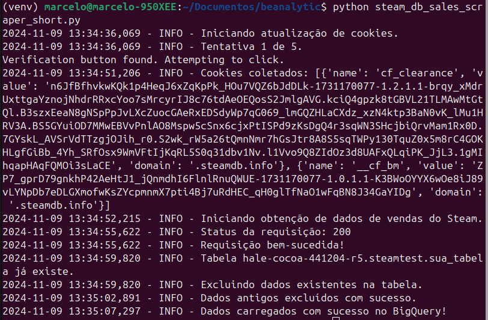

# steamdb-info


## Pré-requisitos
1. **Google Cloud BigQuery**: Configure um projeto no Google Cloud e crie um conjunto de dados e tabela para armazenar os dados do Steam.
2. **Credenciais de Serviço**: Baixe o arquivo JSON com as credenciais do Google Cloud para acesso ao BigQuery.
3. **Python 3.9+**: Certifique-se de que o Python está instalado no ambiente.


## Configuração do Ambiente


1. **Criação de um ambiente virtual**
   ```bash
   python3 -m venv venv
   source venv/bin/activate  # No Windows, use `venv\Scripts\activate`
   ```


2. **Instalação das dependências**
   ```bash
   pip install -r requirements.txt
   ```


3. **Configuração das variáveis de ambiente**
   Crie um arquivo `.env` na raiz do projeto com o seguinte conteúdo:
   ```env
   GOOGLE_APPLICATION_CREDENTIALS="cloud/arquivo.json"
   PROJECT_ID="seu_project_id"
   DATASET_ID="seu_dataset_id"
   TABLE_ID="sua_tabela"
   SCRAPEDO_API_KEY="sua_key" #Pode remover do código o uso do scrapedo, sao 3 linhas de código  
   ```


4. **Google Cloud BigQuery Credentials**
   Coloque o arquivo JSON de credenciais baixado do Google Cloud (ex: `seu_arquivo.json`) na pasta `cloud` e configure a variável `GOOGLE_APPLICATION_CREDENTIALS` no `.env` para apontar para este arquivo.


## Executando o Script de Scraping
O script principal para fazer scraping dos dados do Steam e enviá-los para o BigQuery é o `steam_db_sales_scraper_short.py`.


Para executar o script, use:
```bash
python steam_db_sales_scraper_short.py
```


> **Nota**: O uso do Scrapedo para rotação de IP é opcional. Ele permite alternar proxies automaticamente. Caso deseje, você pode adaptar o código para não usar o Scrapedo ou usar outra ferramenta para rotação de IP.


#### Execução do Scraping

*Descrição:* A visualização mostra o desempenho e o progresso da execução do processo de scraping.


## Dashboard de Análise de Dados
Após os dados estarem no BigQuery, você pode visualizar e analisar os dados em um dashboard feito em Streamlit. O dashboard se conecta ao BigQuery para extrair e exibir informações das vendas do Steam.


Para executar o dashboard:
```bash
streamlit run dashboard.py
```


## Link para o Google Sheets
Para compartilhar os dados, foi criado um Google Sheets conectado ao BigQuery com os dados extraídos. Confira os dados atualizados [neste link](https://docs.google.com/spreadsheets/d/1gvP-EukSc_XbGuRzOC4mHOa9ufYsSwFcu-4CBDos-3A/edit?usp=sharing).


## Prints do Dashboard
Abaixo estão alguns prints do dashboard em execução:


#### 1. Distribuição de Preços

*Descrição:* Esta visualização ilustra a distribuição de preços dos produtos analisados, permitindo observar as faixas de preço mais comuns e identificar potenciais padrões de precificação no mercado.

#### 2. Relação Preço x Avaliação

*Descrição:* Esta análise mostra a correlação entre os preços e as avaliações dos produtos, fornecendo insights sobre como o preço impacta as percepções dos consumidores.


#### 3. Sazonalidade de Promoções

*Descrição:* Este gráfico detalha a sazonalidade das promoções, destacando as épocas do ano em que as promoções são mais frequentes e suas possíveis correlações com eventos ou datas especiais.

#### 4. Melhores Jogos Até R$20

*Descrição:* Apresenta os melhores jogos disponíveis por menos de R$20, com base em critérios como avaliação dos usuários e popularidade.


---


Este é o setup básico para o projeto SteamDB Info! Sinta-se à vontade para customizar o código e adicionar novas análises.
```


Este Markdown explica como configurar o ambiente, inserir as variáveis de ambiente, executar o script de scraping, configurar o Google Sheets para visualizar os dados e rodar o dashboard no Streamlit.

